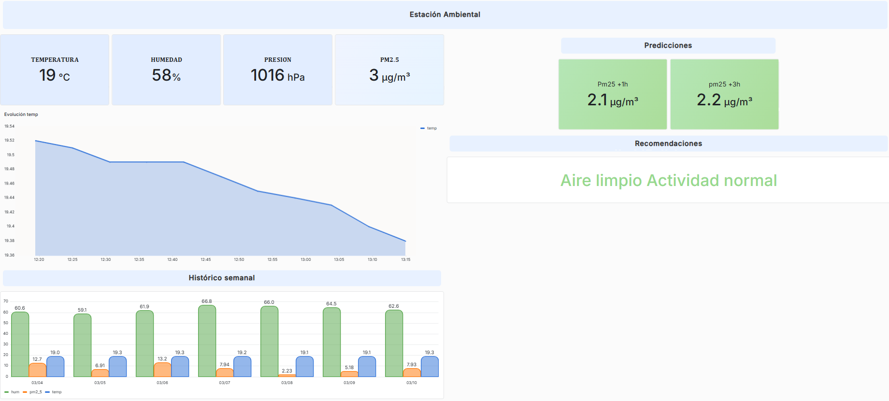

# Air Quality IoT Forecasting System

This project implements an environmental monitoring station capable of measuring and predicting air quality using IoT and Machine Learning.

The system collects environmental data in real time and generates short-term forecasts of PM2.5 concentration.

---

## Dashboard

The dashboard displays real-time environmental measurements together with the predicted PM2.5 values.

---

## System Architecture

The project integrates several components:

IoT station → Data storage → Machine Learning → Automated predictions → Dashboard visualization

---

## IoT Station

The monitoring station is based on an **ESP32** microcontroller and collects environmental data using several sensors.

### Sensors used

- **BME680**  
  Temperature, humidity, pressure and gas resistance.

- **BH1750**  
  Ambient light intensity (lux).

- **PMS7003**  
  Particulate matter concentrations (PM1.0, PM2.5, PM10).

Sensor data is periodically sent to a **time-series database (InfluxDB)**.

---

## Machine Learning

Several models were evaluated for PM2.5 forecasting:

- Linear Regression  
- Random Forest  
- XGBoost  

The **Random Forest model** was selected due to its performance in capturing the temporal dynamics of the PM2.5 time series.

Predictions are generated for:

- **1 hour ahead**
- **3 hours ahead**

---

## Automated Prediction Pipeline

A Python script periodically executes the prediction pipeline.

The pipeline:

1. Retrieves recent PM2.5 measurements from InfluxDB
2. Preprocesses the time series data
3. Loads the trained forecasting model
4. Generates predictions for the next hours
5. Writes predictions back to the database

These predictions are then visualized in the Grafana dashboard.

---

## Technologies Used

- ESP32
- Python
- Machine Learning
- InfluxDB
- Grafana
- GitHub Actions
